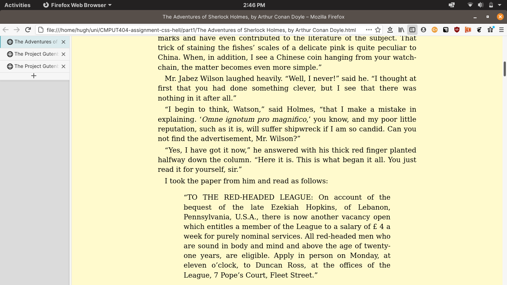
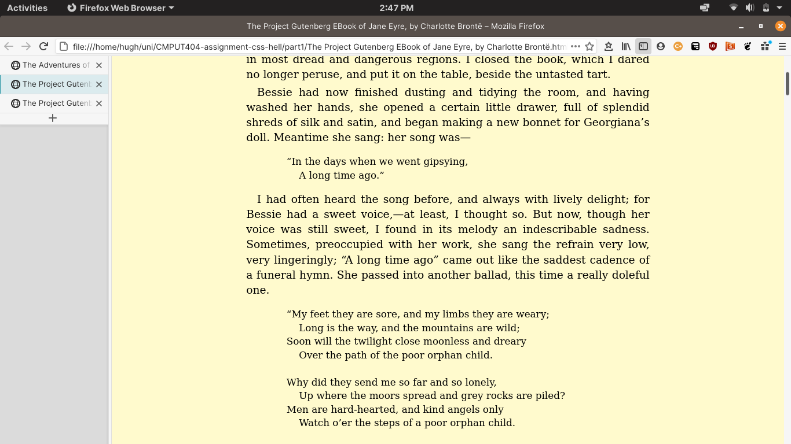
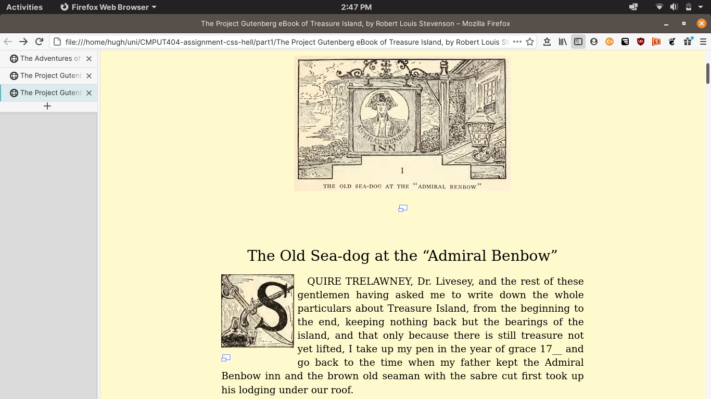

Assignment: CSS Hell
====================

You will skin 3 project gutenberg stories with custom CSS.

You will skin 2 versions of a possible professional homepage for your
self with 2 versions of CSS.

Read requirements.org

Read this comic http://theoatmeal.com/comics/design_hell

git clone https://github.com/abramhindle/CMPUT404-assignment-css-hell.git

License/Copyright
=================

Textual content is copyright Abram Hindle (C) 2013 under the CC-BY-SA
4.0 unported license. Attribution should be a hyperlink to the
repository and (C) 2013 Abram Hindle visibile in the text.

Code is licensed under the Apache 2.0 license.

## Part 1 - Gutenberg HTML

The books came with their own <style> embedded in the HTML, so I commented that out and linked them to my style.css instead. I also added a <meta> viewport tag to make the page scale properly on mobile resolutions. On the whole, these pages do not need many changes. I left the <pre> tag style as-is to respect its purpose.

gutenberg1.png

gutenberg2.png

gutenberg3.png

## Part 2 - Professional & Funny pages